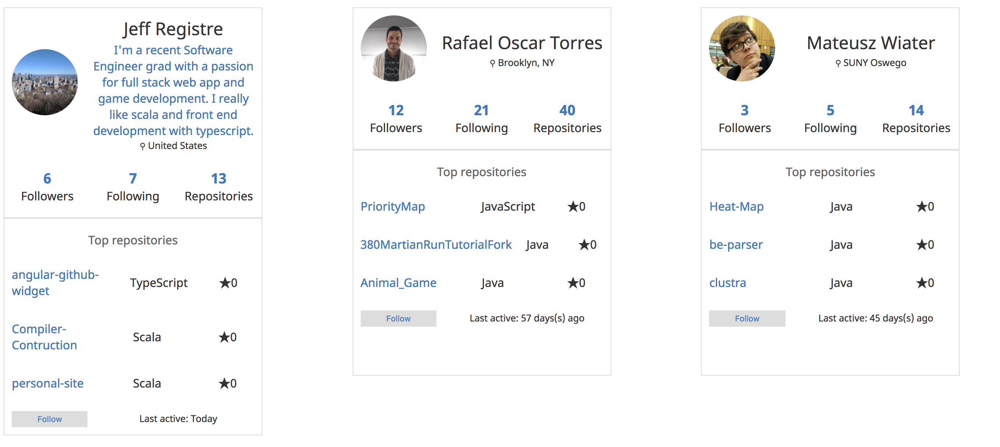

## Angular Github Card
[](https://badge.fury.io/js/ng-github-card)   

Angular Github Card is a simple component that showing your github details. It's quite perfect for
use with a portfolio website. This project is based on [github-widget](https://github.com/surbhioberoi/github-widget). 




### Set Up


##### First, add it to your angular project via npm

```sh
npm install -S angular-github-card
```

Next up, add `NgGithubCardModule` to the `imports` of the module you wish to use this in.   
<b>Like So</b>

```typescript
import { NgModule } from '@angular/core';
import {NgGithubCardModule} from 'ng-github-card';

@NgModule({
    imports: [
            /* Other imports*/
            NgGithubCardModule
        ]
})
export class MyModule {
    
}

```

### Usage

Usage is very simple. Simply use drop the component's selector in your template, bind a value to
`githubUser` and it's ready to go.   
<b>Like So</b>

```angular2html
<ng-github-card [githubUser]="'someGithubUser'"></ng-github-card>
```

##### Configuring the top 3 repositories to show
The widget defaults to sorting your repositories by their start count and picking the top 3 to display.
You can alter this behaviour by specifying a repository name for one or more of the inputs listed below.

* \[top1\]
* \[top2\]
* \[top3\]

These two examples highlight this usage.
```angular2html
<div>
    <ng-github-card [githubUser]="'someGithubUser1'" [top1]="'angular-github-widget'"></ng-github-card>
    <ng-github-card [githubUser]="'someGithubUser2'" [top1]="'angular-github-widget'" [top2]="'an-amazing-repo'"></ng-github-card>
</div>
```

#### Thank You!
Thank you for checking out this project, I hope it's useful to you!
Have a good day!
